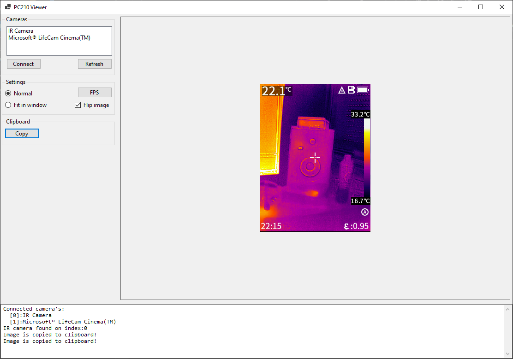
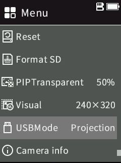

# PC210Viewer
Captue Guide PC210 IR camera

Captures the webcam stream of a Guide PC210 IR camera when put in webcam mode (USBMode = Projection).

We cannot use a 'normal' webcam frame grabber as the PC210 outputs a fliped/mirrored image.

It also has a copy to clipboard function to capture the current shown image to the clipboard.

The projection option can be found in the settings menu of the PC210:

